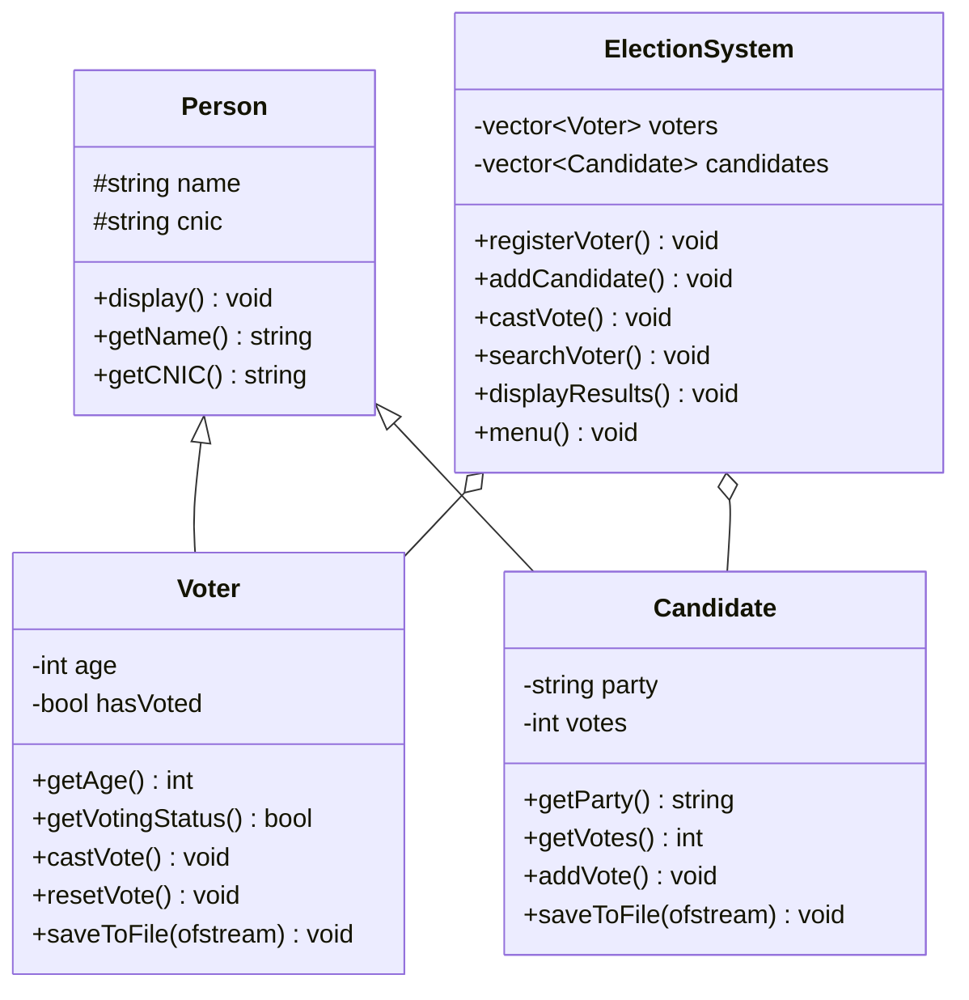

<!-- Replace YOUR_USERNAME and the repository name (e-voting-management-system) before publishing -->

<div align="center">


<a href="https://git.io/typing-svg">
  
</a>

<br/>


**[Features](#features) · [Quick Start](#quick-start) · [Usage](#usage) · [Architecture](#architecture) · [Roadmap](#roadmap) · [Contributing](#contributing)**

</div>

---

## Overview

**E-Voting Management System** is a menu-driven C++ application that simulates a small election end to end. Voters register with a validated CNIC, candidates are managed through the system, every voter can cast **exactly one vote**, and the results (vote counts, percentages and winner) are calculated instantly.

All records are written to plain text files, so data **persists between runs** with no database required.

> Developed as an Object-Oriented Programming course project by **Section B, CS 2025-2029**.

---

## Features

| Module | Capability |
|---|---|
| **Voter registration** | Full name, 13-digit CNIC and age with complete validation (18+ only) |
| **Vote integrity** | A CNIC that has already voted is blocked from voting again |
| **Voter directory** | Tabular list of all voters with their voting status |
| **Voter search** | Instant lookup by CNIC |
| **Candidate management** | Add candidates with a unique ID and political party |
| **Results engine** | Votes, percentage share, total votes and winner |
| **Persistence** | Automatic save and load using `voters.txt` and `candidates.txt` |
| **Input safety** | Handles invalid numbers, malformed CNICs and duplicate IDs |
| **Seed data** | Three sample candidates are created on first launch |

---

## Tech Stack

<div align="center">


</div>

| Area | Details |
|---|---|
| Language | C++11 or later |
| Libraries | `iostream`, `fstream`, `vector`, `string`, `iomanip`, `limits`, `stdexcept` |
| Storage | Pipe-separated text files |
| Paradigm | Object-Oriented Programming |

---

## Quick Start

### Prerequisites

- A C++11-compatible compiler: **g++**, **clang++** or **MSVC**
- Git (optional)

### Clone

```bash
git clone https://github.com/YOUR_USERNAME/e-voting-management-system.git
cd e-voting-management-system
```

### Build

```bash
g++ -std=c++11 main.cpp -o evoting
```

### Run

```bash
# Linux / macOS
./evoting

# Windows
evoting.exe
```

> **Note:** Run the program from the same folder each time. `voters.txt` and `candidates.txt` are created in the working directory.

---

## Usage

```text
====================================================
             E-VOTING MANAGEMENT SYSTEM
====================================================
              C++ OOP PROJECT
====================================================

1. Register Voter
2. Display All Voters
3. Add Candidate
4. Display Candidates
5. Cast Vote
6. Search Voter
7. View Election Results
8. Exit

Enter your choice:
```

**Typical workflow**

1. Register voters (option `1`).
2. Add candidates (option `3`) or use the default ones.
3. Cast votes (option `5`) using the voter CNIC and a candidate ID.
4. View the results (option `7`).

**Default candidates**

| ID | Name | Party |
|---|---|---|
| `C001` | Ali Khan | Unity Party |
| `C002` | Ahmed Raza | People Party |
| `C003` | Sara Malik | Progress Party |

<details>
<summary><b>Sample output: election results</b></summary>

```text
================ ELECTION RESULTS ================
Candidate           Party               Votes     Percentage
--------------------------------------------------------------
Ali Khan            Unity Party         2         50.00%
Ahmed Raza          People Party        1         25.00%
Sara Malik          Progress Party      1         25.00%

Total Votes: 4

Winner: Ali Khan (Unity Party)
```

</details>

<details>
<summary><b>Validation rules and messages</b></summary>

| Condition | Message |
|---|---|
| CNIC is not exactly 13 digits | `Invalid CNIC! CNIC must contain exactly 13 digits.` |
| CNIC already registered | `A voter with this CNIC already exists.` |
| Age below 18 | `Voter must be 18 or above.` |
| CNIC not registered when voting | `Voter not found! Please register first.` |
| Voter has already voted | `You have already cast your vote.` |
| Unknown candidate ID | `Invalid candidate ID.` |
| Duplicate candidate ID | `Candidate ID already exists.` |

</details>

---

## Architecture

<details open>
<summary><b>Class diagram</b></summary>



</details>

**OOP concepts demonstrated**

| Concept | Implementation |
|---|---|
| Inheritance | `Voter` and `Candidate` derive from `Person` |
| Polymorphism | `virtual display()` overridden in both derived classes |
| Encapsulation | `private` / `protected` members exposed through getters |
| Abstraction | `ElectionSystem` hides validation and file handling |
| Composition | `ElectionSystem` owns `vector<Voter>` and `vector<Candidate>` |
| Virtual destructor | `~Person()` is virtual for safe cleanup |
| Constructor overloading | Default and parameterized constructors |
| File handling | `ifstream` / `ofstream` for persistence |
| Exception handling | `try / catch` around `stoi()` when loading files |

**Data format**

```text
voters.txt       name|cnic|age|hasVoted
candidates.txt   name|cnic|party|votes
```

---

## Project Structure

```text
e-voting-management-system/
├── main.cpp            Source code
├── voters.txt          Generated at runtime
├── candidates.txt      Generated at runtime
├── .gitignore
├── LICENSE
└── README.md
```

Recommended `.gitignore`:

```gitignore
evoting
evoting.exe
*.o
voters.txt
candidates.txt
```

---

## Known Limitations

- Names and party names must not contain the `|` character, since it is the file separator.
- In a tie, the first candidate with the highest vote count is shown as winner.
- The main menu expects a number; text input there is not handled.
- Data is stored as plain text, without encryption or admin authentication.
- Voters and candidates cannot be edited or deleted after creation.

> This project is for educational purposes and is not intended for real elections.

---

## Roadmap

- [ ] Admin login with password protection
- [ ] Edit and delete voters and candidates
- [ ] Tie detection in results
- [ ] Robust menu input handling
- [ ] Export results to CSV
- [ ] Hash CNICs before storing
- [ ] Election start and end time
- [ ] Unit tests
- [ ] SQLite backend

---

## Contributing

Contributions are welcome.

1. Fork the repository
2. Create a branch: `git checkout -b feature/your-feature`
3. Commit your changes: `git commit -m "Add your feature"`
4. Push the branch: `git push origin feature/your-feature`
5. Open a Pull Request

---

## Authors

**Section B, CS 2025-2029**

| Name | GitHub |
|---|---|
| Your Name | [@YOUR_USERNAME](https://github.com/YOUR_USERNAME) |

---

## License

Distributed under the **MIT License**. See the `LICENSE` file for details.

<div align="center">

**If this project helped you, consider giving it a star.**


</div>
